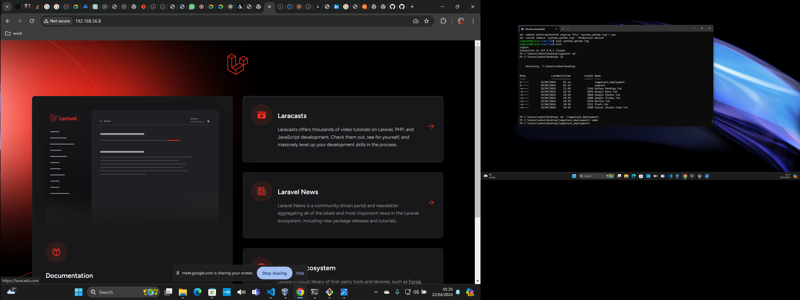
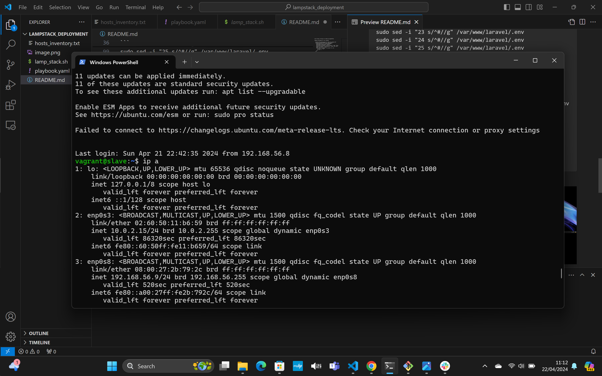
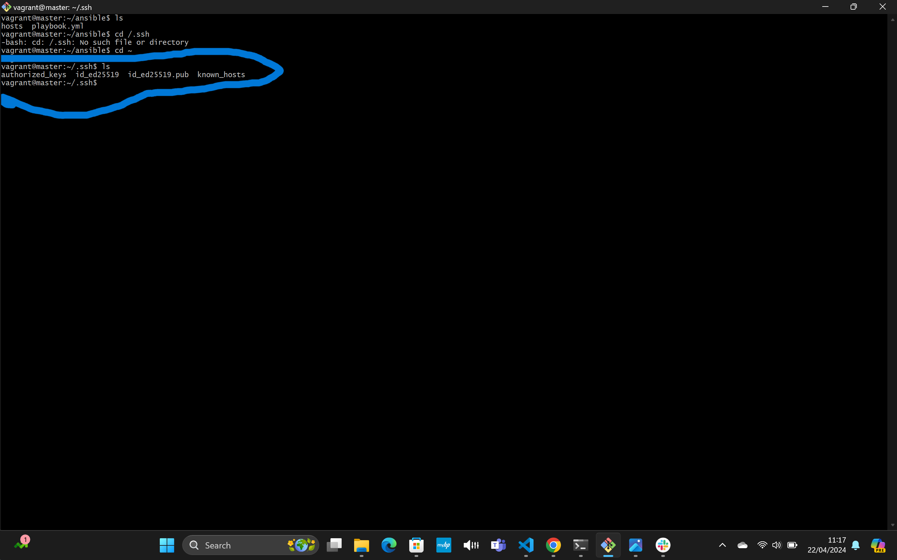
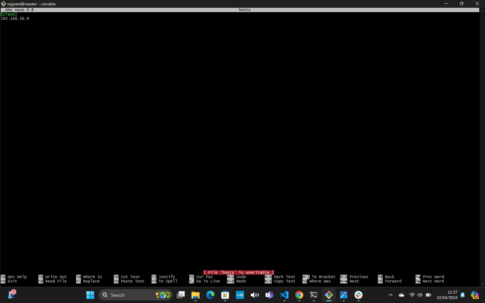
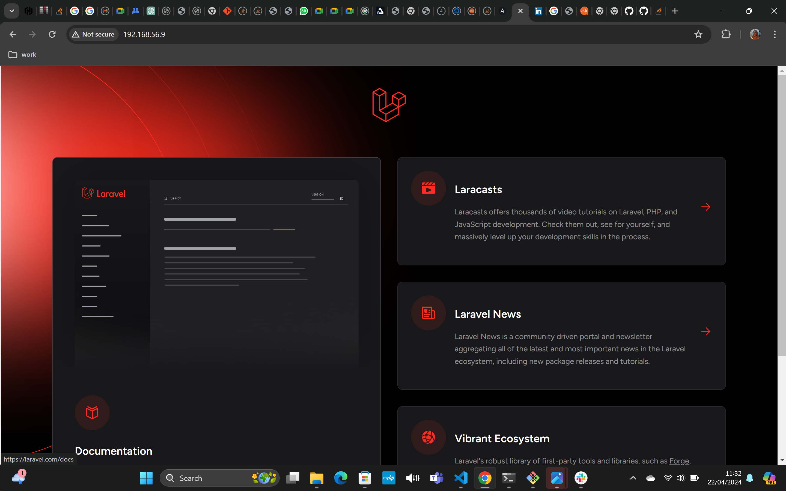
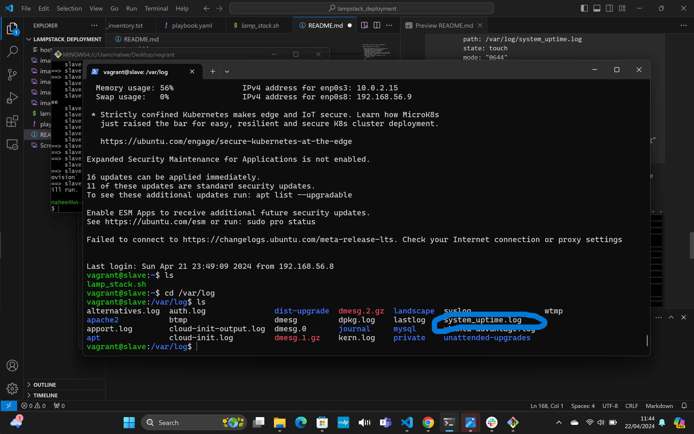
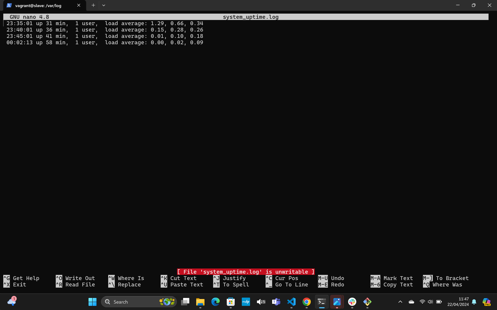

First thing i did was to create my vagrantFile
```
Vagrant.configure("2") do |config|

  # Define VM configuration for the first Ubuntu VM
  config.vm.define "master" do |masternode|
    masternode.vm.box = "ubuntu/focal64"
    masternode.vm.hostname = "master"
    masternode.vm.network "private_network", type: "dhcp"
    config.vm.network "forwarded_port", guest: 80, host: 8080, auto_correct: true
    masternode.vm.provider "virtualbox" do |vb|
      vb.memory = "1024"
      vb.cpus = 1
    end
  end

  # Define VM configuration for the second Ubuntu VM
  config.vm.define "slave" do |second|
    second.vm.box = "ubuntu/focal64"
    second.vm.hostname = "slave"
    second.vm.network "private_network", type: "dhcp"
    config.vm.network "forwarded_port", guest: 80, host: 8081, auto_correct: true
    second.vm.provider "virtualbox" do |vb|
      vb.memory = "1024"
      vb.cpus = 1
    end
  end

end


```

STEP2: I then ssh into my master by using vagrant ssh master. I then created my bashscript. Ran the bash script on my master first to see if it will work. Had some issues at first as the laravel page was not showing because the script is not writing into my laravel .env file, but i was able to figure it out by researching on the "sed" command

```
#!/bin/bash
#update your linux system
sudo apt update -y
#install your apache webserver
sudo apt install apache2 -y
#add the php ondrej repository
sudo add-apt-repository ppa:ondrej/php --yes
#update your repository again
sudo apt update -y
# install php8.2
sudo apt install php8.2 -y
#install some of those php dependencies that are needed for laravel to work
sudo apt install php8.2-curl php8.2-dom php8.2-mbstring php8.2-xml php8.2-mysql zip unzip -y
#enable rewrite
sudo a2enmod rewrite
#restart your apache server
sudo systemctl restart apache2
#change directory in the bin directory
cd /usr/bin
install composer globally -y
sudo curl -sS https://getcomposer.org/installer | sudo php -q
#move the content of the deafault composer.phar
sudo mv composer.phar composer
#change directory in /var/www directory so we can clone of laravel repo there
cd /var/www/
sudo git clone https://github.com/laravel/laravel.git
sudo chown -R $USER:$USER /var/www/laravel
cd laravel/
install composer autoloader
composer install --optimize-autoloader --no-dev --no-interaction
composer update --no-interaction
#copy the content of the default env file to .env 
sudo cp .env.example .env
sudo chown -R www-data storage
sudo chown -R www-data bootstrap/cache
cd
cd /etc/apache2/sites-available/
sudo touch latest.conf
sudo echo '<VirtualHost *:80>
    ServerName localhost
    DocumentRoot /var/www/laravel/public

    <Directory /var/www/laravel>
        AllowOverride All
    </Directory>

    ErrorLog ${APACHE_LOG_DIR}/laravel-error.log
    CustomLog ${APACHE_LOG_DIR}/laravel-access.log combined
</VirtualHost>' | sudo tee /etc/apache2/sites-available/latest.conf
sudo a2ensite latest.conf
sudo a2dissite 000-default.conf
sudo systemctl restart apache2
cd
sudo apt install mysql-server -y
sudo apt install mysql-client -y
sudo systemctl start mysql
sudo mysql -uroot -e "CREATE DATABASE Naheemah;"
sudo mysql -uroot -e "CREATE USER 'naima'@'localhost' IDENTIFIED BY 'naima@2020';"
sudo mysql -uroot -e "GRANT ALL PRIVILEGES ON Naheemah.* TO 'naima'@'localhost';"
cd /var/www/laravel
sudo sed -i "23 s/^#//g" /var/www/laravel/.env
sudo sed -i "24 s/^#//g" /var/www/laravel/.env
sudo sed -i "25 s/^#//g" /var/www/laravel/.env
sudo sed -i "26 s/^#//g" /var/www/laravel/.env
sudo sed -i "27 s/^#//g" /var/www/laravel/.env
sudo sed -i '22 s/=sqlite/=mysql/' /var/www/laravel/.env
sudo sed -i '23 s/=127.0.0.1/=localhost/' /var/www/laravel/.env
sudo sed -i '24 s/=3306/=3306/' /var/www/laravel/.env
sudo sed -i '25 s/=laravel/=Naheemah/' /var/www/laravel/.env
sudo sed -i '26 s/=root/=naima/' /var/www/laravel/.env
sudo sed -i '27 s/=/=naima@2020/' /var/www/laravel/.env
sudo php artisan key:generate
sudo php artisan storage:link
sudo php artisan migrate
sudo php artisan db:seed
sudo systemctl restart apache2
```

STEP3: I was able to view the laravel page on master


Step4: Next i need to automate the deployment to the slave. I first ssh into the slave to see if it is accessible. I then checked the ip of the slave using "ip a"




STEP4: I then created a directory on my master node, cd into it. installed ansible on the master with the necessary dependency from the ansible documentation. I also created a ssh key using the ssh-keygen command


STEP5: Copied the sshkey from master to slave authorized key

STEP 6: created my host file on the slave node


STEP7: Created my playbook
```
- name: Run and execute lamp bash script on slave node
  hosts: all
  become: true
  tasks:
    - name: Transfer bash script from master to slave
      copy:
        src: /home/vagrant/lamp_stack.sh
        dest: /home/vagrant/lamp_stack.sh
        owner: root
        group: root
        mode: '0755'

    - name: Execute the bash script on slave node
      script: /home/vagrant/lamp_stack.sh

    - name: Ensure the log file exists
      file:
        path: /var/log/system_uptime.log
        state: touch
        mode: "0644"
        owner: root
        group: root

    - name: cron job to check uptime
      cron:
        name: check uptime
        minute: "0"        # Run at minute 0 (midnight)
        hour: "0"          # Run at hour 0 (midnight)
        job: "/usr/bin/uptime >> /var/log/system_uptime.log"

```
step8: Ping my slave node to see if it rechable with adhoc command "ansible hosts -m ping"

step9: Ran my playbook
.png>)

step9: Checked the slave  Ip on my browser to see if it worked


STEP10: Checked to see if my cronjob worked and if the system_uptime.log file was created


STEP11: Before runnimg the cron job at every midnight, I had edited my playbook to run the job at every 5minutes to see if it worked. When i was sure it worked, only then did i edit my job to run at midnight. see below output of every 5mins

